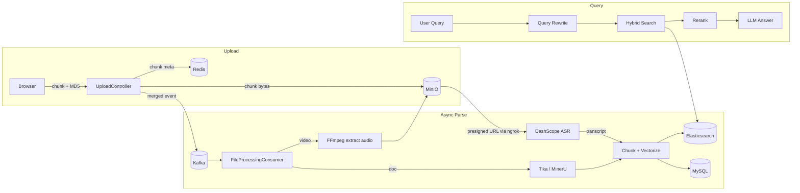

# VideoMind

**AI 视频解析与知识库构建平台**

一个覆盖 **用户鉴权、视频上传、视频解析与 AI 总结** 的视频内容理解平台；同时支持上传与解析其他类型文件，基于文件内容构建专属知识库，实现高效内容检索，并借助 **RAG（检索增强生成）** 显著降低大模型回答的幻觉问题。

视频通过 **FFmpeg** 抽取音轨、阿里云 **DashScope Paraformer-v2（FunASR 系列）** 转写为文本后，进入与普通文档相同的 **分块入库与向量化** 流程；文档侧可选用 **MinerU** 提升复杂 PDF 解析质量（失败自动降级 **Apache Tika**），结合 **Elasticsearch** 关键词检索 + 向量语义检索的混合召回，并采用RRF算法初排 + Rerank 精排策略，最终为大模型提供高质量上下文。

仓库：<https://github.com/qmtn23/VideoMind>

---

## 技术亮点

1. **上传/解析全异步化** — 基于 **Kafka** 解耦文件上传、解析与向量化流程，长视频上传接口响应时间从 50s+ 压缩到 **45ms 以内**，解析过程异步执行不阻塞用户操作。
2. **多模态知识库** — 接入阿里云 DashScope 大模型，对视频进行 **ASR + AI 总结**；同时使用 **Tika + MinerU** 对 PDF/Word/PPT/图片等文档做精准、完整的内容解析，构建多模态专属知识库。
3. **混合检索 + Rerank 精排** — 对用户查询进行 **查询改写**，通过 Elasticsearch 完成 **关键词检索 + 向量语义检索** 的混合召回，先用 **线性加权策略初排**，再交由 **Rerank 模型精排**，显著提升 Top-K 准确率。
4. **大文件分片 + 断点续传** — 用 **Redis** 维护文件分片状态，结合 **MinIO** 实现 **分片上传与断点续传**，解决了网络抖动导致的上传中断问题，大幅提高大文件传输可靠性。
5. **分布式锁 + 幂等控制** — 落地 **Redisson + WatchDog** 分布式锁机制，结合 **MD5 内容级去重** 实现接口幂等控制，并发场景下拦截重复提交，避免不必要的 Token 损耗与重复解析。
6. **令牌桶限流** — 基于 **Redis 令牌桶算法** 的限流策略，按单位时间设置请求上限，限制高频访问与恶意请求，保护后端 LLM/向量服务。

---

## 技术栈

| 分类 | 组件 |
|------|------|
| 后端 | Java 17、Spring Boot 3、Spring Data JPA、Spring Security + JWT |
| 数据 | MySQL 8、Redis 7、Elasticsearch 8.10 |
| 中间件 | Kafka 3.2、MinIO（对象存储） |
| 文档/媒体 | Apache Tika、MinerU（可选 PDF 增强）、FFmpeg |
| AI 能力 | DashScope（对话 / Embedding / **Paraformer-v2 ASR**） |
| 前端 | Vue 3、TypeScript、Vite、Pinia、Vue Router、Naive UI、UnoCSS、pnpm |

---

## 系统架构



---

## 环境要求

| 工具 | 说明 |
|------|------|
| **Java 17** | 后端运行 |
| **Maven 3.8.6+** | 构建与 `spring-boot:run` |
| **Node.js 18.20.0+ / pnpm 8.7.0+** | 前端 |
| **Docker Desktop** | 一键启动依赖中间件 |
| **FFmpeg** | **视频解析必需**，用于从视频抽取音轨供 ASR |
| **DashScope API Key** | **必需**，对话/向量/ASR 三件套都依赖（可共用一把 Key） |
| **ngrok 或公网域名** | **视频解析必需**，DashScope 需从公网拉取 MinIO 上的临时音频 |

---

## 本地部署

> 设计原则：**Docker 只跑中间件**；后端、前端在宿主机运行；**敏感配置放在 `application-local.yml`，已加入 `.gitignore`**。

### 第 1 步：启动依赖中间件

```powershell
cd docs
docker compose up -d
docker ps   # 确认 mysql / redis / kafka / es / minio 五个容器均为 Up
```

**首次启动需创建数据库与存储桶**（仅一次）：

```powershell
# 创建 MySQL 数据库（密码以 docs/docker-compose.yaml 为准）
docker exec mysql mysql -uroot -pPaiSmart2025 -e "CREATE DATABASE IF NOT EXISTS PaiSmart CHARACTER SET utf8mb4 COLLATE utf8mb4_unicode_ci;"
```

浏览器打开 MinIO 控制台 <http://localhost:19001>（账号见 `application.yml` / Compose），创建名为 `uploads` 的 Bucket。

> **本机端口提示**：若你的本机 MySQL 已占用 3306，本仓库 [`docs/docker-compose.yaml`](docs/docker-compose.yaml) 默认把 Docker MySQL 映射到 **13306**；JDBC URL 需相应改为 `jdbc:mysql://localhost:13306/PaiSmart`（见下一步）。

**Kafka Topic（重要）**：[`application.yml`](src/main/resources/application.yml) 中 `spring.kafka.topic.file-processing` 默认为 `file-processing-topic1`，DLT 为 `file-processing-dlt`。本仓库 Compose 已配置 `KAFKA_AUTO_CREATE_TOPICS_ENABLE=true`；如未自动创建，可手动在容器内执行：

```powershell
docker exec -it kafka kafka-topics.sh --bootstrap-server localhost:9092 --create --partitions 1 --replication-factor 1 --topic file-processing-topic1
docker exec -it kafka kafka-topics.sh --bootstrap-server localhost:9092 --create --partitions 1 --replication-factor 1 --topic file-processing-dlt
docker exec -it kafka kafka-topics.sh --bootstrap-server localhost:9092 --create --partitions 1 --replication-factor 1 --topic vectorization
```

### 第 2 步：本地配置

复制 [`application-local.example.yml`](src/main/resources/application-local.example.yml) 为 `src/main/resources/application-local.yml`，按需填写：

```yaml
spring:
  datasource:
    url: jdbc:mysql://localhost:13306/PaiSmart?useSSL=false&serverTimezone=UTC&allowPublicKeyRetrieval=true

jwt:
  secret-key: "<openssl rand -base64 32 生成的强随机字符串>"

deepseek:
  api:
    key: "<DashScope API Key>"

embedding:
  api:
    key: "<DashScope API Key>"

asr:
  enabled: true
  api:
    key: "<DashScope API Key>"

ffmpeg:
  path: "C:/path/to/ffmpeg.exe"   # 不在 PATH 时需配置绝对路径

minio:
  publicUrl: "https://<你的 ngrok 域名>"   # DashScope 需从公网拉取临时音频
```

> 视频 ASR 三件必备：**有效的 `asr.api.key`**、**FFmpeg 可用**、**`minio.publicUrl` 公网可达**。任一缺失都会被启动时的 [`MinioPublicUrlChecker`](src/main/java/com/qmtn/videomind/config/MinioPublicUrlChecker.java) 提前告警，并在视频上传时直接拒绝。

### 第 3 步：启动 ngrok（视频功能必需）

DashScope 服务在公网，需要能拉取到 MinIO 上的临时音频。本地开发用 ngrok 暴露 MinIO 的 **API 端口 19000**：

```powershell
ngrok http --url=<your-ngrok-domain>.ngrok-free.dev 19000
```

把输出的公网域名同步写回 `application-local.yml` 的 `minio.publicUrl`。

> **重要**：本仓库已实现 **双 `MinioClient` 预签名修复**（[`MinioConfig`](src/main/java/com/qmtn/videomind/config/MinioConfig.java)、[`MinioAudioService`](src/main/java/com/qmtn/videomind/service/MinioAudioService.java)），预签名直接用公网 endpoint 计算签名，**不会再因 ngrok Host 改写导致 S3 V4 签名 403**。

### 第 4 步：启动后端

```powershell
mvn spring-boot:run "-Dspring-boot.run.profiles=local"
```

成功标志：日志出现 **`Started VideoMindApplication`**，端口 **8081**。
随后会看到启动检查输出：`[视频功能] minio.publicUrl 可达，响应码: 200 — 视频 ASR 链路就绪`。

### 第 5 步：启动前端

```powershell
cd frontend
pnpm install   # 仅首次
pnpm dev
```

打开终端输出的本地地址（默认 <http://localhost:9527>）。默认管理员账号：**`admin` / `admin123`**（由 `application.yml` 中 `admin.*` 初始化）。

### 异步处理流程说明

合并分片成功后，后端将解析任务发往 Kafka，由消费者异步执行解析（含视频 ASR）与向量化。因此：

- **HTTP 合并接口会很快返回**（通常 <100ms）
- **可检索时间** 取决于文件大小与 ASR/向量耗时；大视频会更慢
- **排查路径**：后端日志目录 `./logs/` 下 `videomind.*.log`、`error.*.log`、`business.*.log`

---

## 一键启动脚本（Windows）

仓库根目录提供 [`start.ps1`](start.ps1)，在 **Windows PowerShell** 下自动完成以下全流程：

```
读取 minio.publicUrl → 检查 Docker 容器 → 启动 ngrok → 启动后端 → 启动前端
```

### 前提条件

在运行脚本前，请确认：

1. **Docker Desktop 已启动**，且 5 个容器（`mysql` / `redis` / `kafka` / `es` / `minio`）均为 `Up` 状态（`docker ps` 验证）。
2. **`src/main/resources/application-local.yml` 已存在**，并正确填写了 API Key、数据库端口等敏感配置（参考 `application-local.example.yml`）。
3. **ngrok 已安装**（`ngrok version` 能正常输出），且 `minio.publicUrl` 配置了你的 ngrok 固定域名（视频功能必需；普通文档功能不受影响）。

### 用法

```powershell
# 首次运行：放开当前用户的脚本执行策略
Set-ExecutionPolicy -Scope CurrentUser RemoteSigned

# 一键启动（默认 profile=local）
.\start.ps1

# 指定 Spring profile
.\start.ps1 -SpringProfile dev
```

脚本执行顺序：

| 步骤 | 动作 | 说明 |
|------|------|------|
| 0 | 读取 `minio.publicUrl` | 从 `application-local.yml` 解析 ngrok 域名；未配置时跳过 ngrok，打印 WARN |
| 1 | 检查 Docker 容器 | 检测 mysql / redis / kafka / es / minio 是否均在运行；缺失则询问是否继续 |
| 2 | 启动 ngrok | 若域名已配置且 ngrok 未运行，自动执行 `ngrok http --url=<域名> 19000`；已运行则跳过 |
| 3 | 启动后端 | 若 8081 端口空闲，在新 PowerShell 窗口运行 `mvn spring-boot:run`；已占用则跳过 |
| 4 | 启动前端 | 若 9527 端口空闲，在新 PowerShell 窗口运行 `pnpm dev`；已占用则跳过 |

启动完成后控制台会输出访问地址：

```
Frontend: http://localhost:9527
Backend:  http://localhost:8081
ngrok:    http://127.0.0.1:4040
Login:    admin / admin123
```

> 后端和前端在**各自独立的新窗口**中运行，关闭对应窗口即可停止对应服务。
> Spring Boot 首次启动编译约需 30-60 秒，前端首次运行会自动安装依赖（`pnpm install`），请稍等。

### 常见问题

| 现象 | 原因 | 解决方式 |
|------|------|----------|
| 脚本报"无法加载，因为在此系统上禁止运行脚本" | 执行策略限制 | 运行 `Set-ExecutionPolicy -Scope CurrentUser RemoteSigned` |
| `[WARN] Docker 未就绪` | Docker Desktop 未启动 | 启动 Docker Desktop，等待引擎就绪后重试 |
| `[WARN] 以下容器未运行: kafka, es` | 容器未启动 | 执行 `cd docs; docker compose up -d` 后重试 |
| `[WARN] 端口 8081 已占用，跳过后端启动` | 上次后端窗口未关闭 | 关闭旧后端窗口或 `Stop-Process -Id <pid> -Force` 后重试 |
| `[WARN] ngrok 15 秒未就绪` | ngrok 启动慢或账号未授权 | 手动运行 `ngrok http --url=<域名> 19000` 并检查 <http://127.0.0.1:4040> |

---

## 配置说明（摘要）

| 配置块 | 用途 |
|--------|------|
| `deepseek.api.*` | 对话 LLM（与 DashScope 兼容） |
| `embedding.api.*` | 文本向量（DashScope text-embedding-v4） |
| `asr.*` | **核心必选** — 视频 ASR（依赖 FFmpeg + 有效 Key + 公网 `minio.publicUrl`） |
| `mineru.api.*` | 可选 — PDF 高质量解析（失败自动降级 Tika） |
| `minio.*` | 对象存储；`bucketName` 默认 `uploads`；`publicUrl` 用于 DashScope 公网拉取 |
| `spring.kafka.*` | 异步解析队列；Topic 名须与实际 Kafka 一致 |

---

## 常见问题

| 问题 | 排查方向 |
|------|----------|
| MySQL `Access denied` | 确认 JDBC 端口（13306 还是 3306）与 root 密码与 Compose 一致 |
| MinIO 上传报 `bucket does not exist` | 在 <http://localhost:19001> 创建 `uploads` 桶 |
| 上传成功但分块为空 / 检索不到 | 看 `./logs/error.*.log` 是否有解析异常；检查 Kafka Topic 是否一致 |
| 视频 ASR `FILE_DOWNLOAD_FAILED` | ngrok 未启动 / `minio.publicUrl` 与实际域名不一致 / 域名失效 |
| 视频 ASR `FILE_403_FORBIDDEN` | 旧的预签名 Host 改写已修复；若仍出现，确认后端启动后是否输出「视频 ASR 链路就绪」 |
| 视频上传被拒「ASR 未就绪」 | `asr.api.key` / `ffmpeg.path` / `minio.publicUrl` 三者必须齐备 |
| FFmpeg 找不到 | 终端 `ffmpeg -version` 自检；或在 `application-local.yml` 配 `ffmpeg.path` 绝对路径 |
| 端口 8081 已被占用 | 结束占用进程或修改 `server.port`（前后端代理同步） |
| 前端「生成摘要」超时 | 摘要为同步长耗时接口，前端已对其单独放宽超时；如仍超时可调更大或异步化 |
| 启动时 WARN「minio.publicUrl 不可达」 | [`MinioPublicUrlChecker`](src/main/java/com/qmtn/videomind/config/MinioPublicUrlChecker.java) 的告警，按框内提示逐项排查（ngrok / Docker / 域名一致性） |

---

## 开发与安全

- **不要** 将 `application-local.yml`、真实 Key、JWT secret 提交到公开仓库
- 发布前用 `git diff` / `git log` 自检敏感信息
- 生产部署需补充：HTTPS、密钥管理、Kafka 分区/消费组扩容、对象存储 CDN 等
- 本仓库不附带应用镜像 Dockerfile，生产需自行打包 JAR + 静态资源

---

## License

以仓库根目录 [LICENSE](LICENSE) 文件为准。

如果这个项目对您有帮助，还请给个星星

